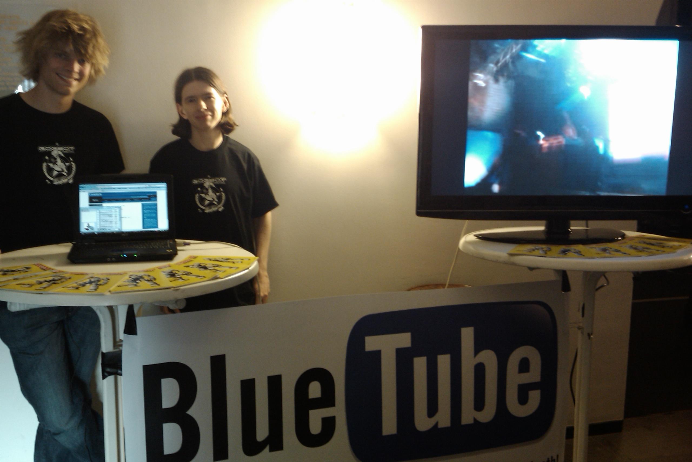

Bluetube, created by VU student Peter Peerdeman, is a bluetooth system that waits for users to send their image and video content via bluetooth. Whenever a user sends his image or video it is automatically uploaded to Picasa or Youtube. This way, a visitor of Gogbot can share his or her content to the rest of the world without having to go through the hassle of copying their content to a pc, creating an online account and manually uploading the content themselves. Because the content is automatically tagged with "gogbot09", the content can easily be found and included in other programs or websites. In addition to the online upload, the uploaded content is shown right away on a projector screen at the Bluetube stand.

This was successfully deployed on the Gogbot 2009 festival, as seen in the pictures below!

-   [Link to GogbotBlueTube Youtube account](http://www.youtube.com/gogbotbluetube)
-   [Link to GogbotBlueTube Picasa account](http://picasaweb.google.com/gogbotbluetube/DropBox)
-   [Gogbot Feed Website by fellow VU student Peter Gels](http://www.few.vu.nl/~design0906/final/moonmoon-8.12/)

Photo's [GogBot](http://www.gogbot.nl) 2009
===========================================

Version Changes
===============

-   0.9 beta - first release, bluetooth upload functionality to youtube
    and picasa
-   1.5 - added drag and drop support, added gogbot search function

Downloads
=========

-   [Download BlueTube application version 1.5](BlueTube1.5.zip)
-   [Download BlueTube logo](bluetube-logo.png)
-   [Download BlueTube Ad](bluetube-ad.png)

Project info
============

The BlueTube application is basically the system that I described in the [Concept](http://www.few.vu.nl/~ppeerde/design0907/index.php?p=concept). This application serves as a bluetooth system that waits for users to send their video's and images via bluetooth. When for instance a phone sends an image or video to the server, the server saves the file locally and in addition to that uploads it to either Youtube if the file was a video or Picasa if it were an image. In this we, we can gather user content on for instance a festival without depending on the users to upload and correctly tag the content themselves.

After the images are uploaded, I planned on setting up a big screen (beamer) on the booth where we are gathering the content which displays the uploaded work instantly. In addition to the local viewing of user content, I have cooperated with [Peter Gels](http://www.few.vu.nl/~psgels) to create a visualization of the youtube and picasa content. He has created a [Gogbot Feed Website](http://www.few.vu.nl/~design0906/final/moonmoon-8.12/) which displays all the usercontent from several communities such as Youtube and Picasa based on the tag "gogbot09". In this way all of the videos uploaded by BlueTube can be seen on his page.

Future Improvements
===================

-   Bluetooth address name resolving, display the name of the bluetooth device instead of its address
-   Create an alternative way of dispaying the uploaded video's maybe even in application itself
-   Multi user environment using extra threading
-   Vulnerability checking: checking for malicous files and other bluetooth connections
